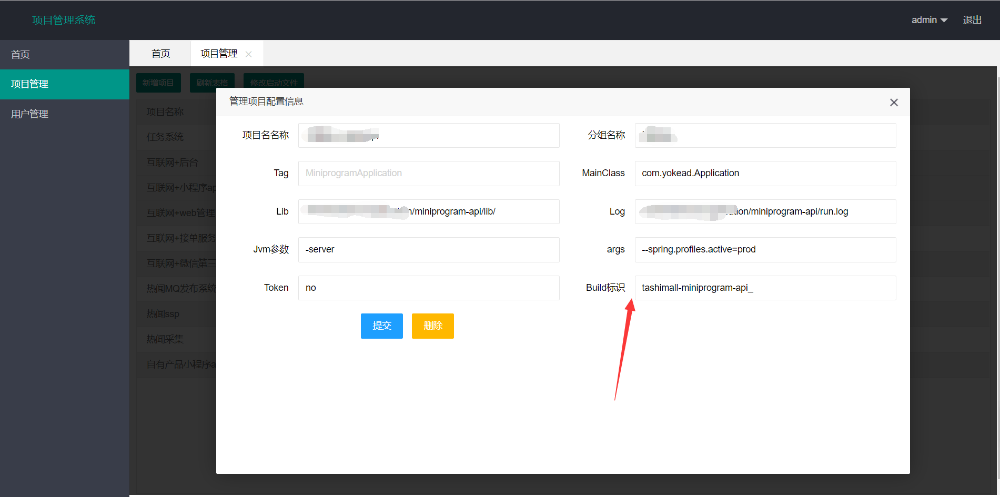

# 阿里云 CodePipeline 配置说明

> 阿里云CodePipeline是一款提供持续集成/持续交付能力，并完全兼容Jenkins的能力和使用习惯的SAAS化产品。通过使用阿里云CodePipeline，您可以方便的在云端实现从代码到应用的持续集成和交付，方便您快速的对您的产品进行功能迭代和演进。

> Jpom 为了方便用户快速安装项目包和快速回滚添加支持 CodePipeline，推荐和码云搭配使用

码云配置说明文档：[https://gitee.com/jiangzeyin/jpom/paas/code_pipeline](https://gitee.com/jiangzeyin/jpom/paas/code_pipeline)

阿里云CodePipeline说明文档：[https://help.aliyun.com/document_detail/56512.html?spm=5176.145865.755375.doc1.230f163fuW7gQs](https://help.aliyun.com/document_detail/56512.html?spm=5176.145865.755375.doc1.230f163fuW7gQs)

## Jpom 配置CodePipeline构建
1. 在CodePipeline 后台创建项目并获取项目名称

2. 在Jpom 配置对应项目的 CodePipeline 项目名称(记得结尾添加一个`_`奥)
    
    
3. 配置阿里云oss 信息，在项目运行数据目录添加如[/bin/data/oss_dev.json](/bin/data/oss_dev.json),dev 是根据boot项目当前运行模式，默认为dev,如项目运行模式为prod 则文件名应为【oss_prod.json】

4. 在项目列表中操作点击构建按钮
    
    
5. 点击安装按钮间自动从阿里云oss 中下载并解压到项目的lib 路径

6. 在项目控制台中点击重启完成CodePipeline构建更新项目