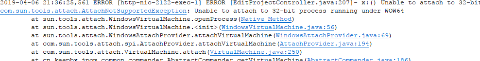

# 常见问题

### 忘记系统管理员密码

> 1. 删除服务端的数据目录中【data/user.json】所有用户信息将失效，需要重新初始化系统管理员账号信息（次操作不会其他其他信息以及项目运行状态）

> 2. 重新确定密码，并js sha1后修改【data/user.json】中对应的系统管理员中的密码字段即可
    
### 在linux 系统中执行管理sh 提示


执行如下命令：(https://blog.csdn.net/perter_liao/article/details/76757605)

```
1.编辑文件
vim filename（文件名）
  
2.进入末行模式（按esc键）

3.设置文件格式
:set fileformat=unix
 
4.保存退出
 :wq
 
5.#sh filename
  OK!
```
  
> 同时需要注意文件编码格式和内容换行符 

### windows 中执行管理bat命令乱码或者执行失败

> 请修改文件编码为当前系统默认的编码（windows中默认为GB2312）、检查文件内容换行符

### 启动Jpom提示


Jpom需要Jdk1.8以上，请检查jdk版本

###  Jpom使用Nginx代理推荐配置

[查看>>](../辅助配置/nginx-config.md)

### Jpom添加项目、启动、查看项目报错

1.运行的java进程有32位和64位的



2.抛出异常Unable to open socket file: target process not responding or HotSpot VM not load。


针对以上两个问题，Jpom目前采用略过这些进程的解决办法，请更新到2.3.1以上。 


### windows 环境 com.sun.tools.attach.AttachNotSupportedException: no providers installed 之类异常

> 问题原因${JAVA_HOME}/jre/bin/attach.dll 文件没有找到，检查当前Jdk环境是否安装完整

### windows 环境 java.util.ServiceConfigurationError: com.sun.tools.attach.spi.AttachProvider: Provider sun.tools.attach.WindowsAttachProvider could not be instantiated

> 问题原因${JAVA_HOME}/jre/bin/attach.dll 文件没有找到，将这个文件复制到${JAVA_HOME}/bin/目录下即可；前提是${JAVA_HOME}/bin/目录已经加入到操作系统的path环境变量下；
>
>或者
>
> 解决方法：将jdk原路径下的jre/bin路径添加到环境变量path下。

### 查看控制台日志中文乱码

> 由于没人采用自动识别文件编码格式，可能不准确，如果明确日志问酒店编码格式。可以在插件端外部文件【extConfig.yml】中指定

### 常见问题未知问题

https://github.com/alibaba/arthas/issues/347

https://bugs.java.com/bugdatabase/view_bug.do?bug_id=4770092

### windows 环境项目在运行中不能删除文件

> 由于系统原因，暂时还没有找到解决办法
