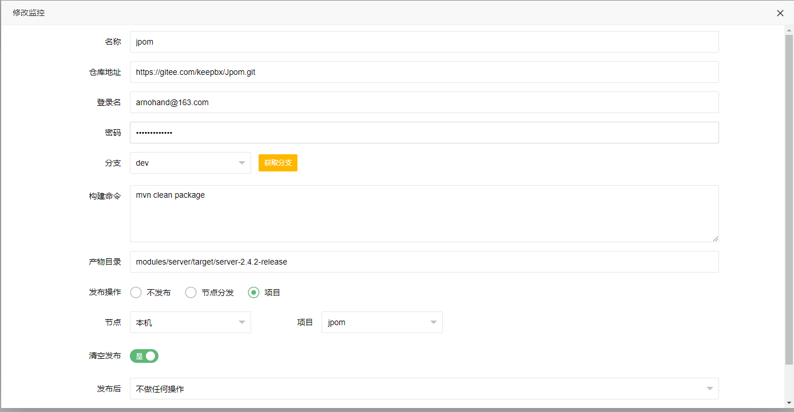

> 在线构建是提供方便快速方便在服务器中构建然后发布到项目或者分发到节点中个功能

> 目前构建支持git仓库的拉取

#### 构建属性

1. 仓库地址
2. 登录名
3. 登录密码
4. 分支
    >  点击 获取分支 拉取该项目下的所有分支
4. 构建命令
5. 构建产物
    > 执行构建命令后构建产物的相对路径
    
        如jpom项目执行 mvn clean package 构建命令：
        构建产物相对路径为：modules/server/target/server-2.4.2-release
    
        
6. 发布操作
    1. 不发布
        > 只构建构建后不执行任何操作
    2. 节点分发
        > 选择已经创建的分发项
    3. 项目
        > 选择节点和项目，再选择发布后操作（重启）

### 注意

1. 当前正在构建中必须等待上次构建结束后才能再次构建
