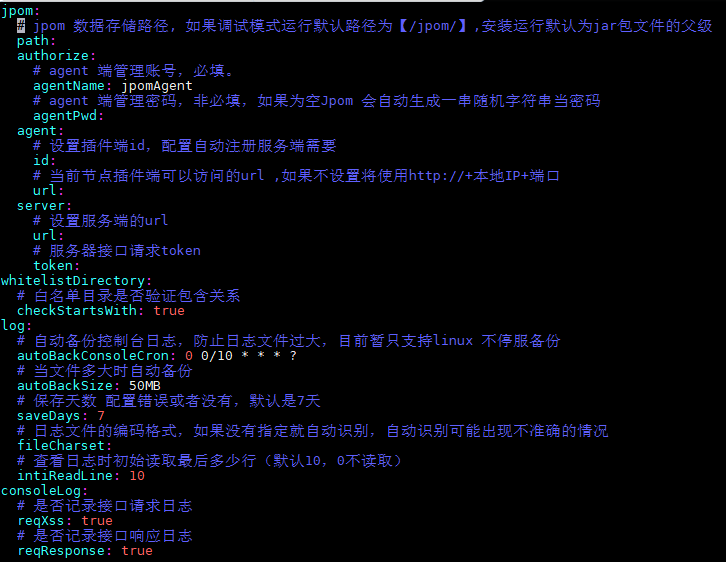
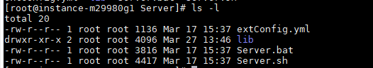

### 目前提供的安装方式

### 一键安装（linux）

#### 插件端

> 安装的路径位于执行命令目录（数据、日志存放目录默认位于安装路径,如需要修改参考配置文件：[`extConfig.yml`](https://gitee.com/dromara/Jpom/blob/master/modules/agent/src/main/resources/bin/extConfig.yml) ）

```
yum install -y wget && wget -O install.sh https://dromara.gitee.io/jpom/docs/install.sh && bash install.sh Agent

备用地址

yum install -y wget && wget -O install.sh https://cdn.jsdelivr.net/gh/dromara/Jpom/docs/install.sh && bash install.sh Agent

支持自动安装jdk环境

yum install -y wget && wget -O install.sh https://dromara.gitee.io/jpom/docs/install.sh && bash install.sh Agent jdk

```

#### 服务端

> 安装的路径位于执行命令目录（数据、日志存放目录默认位于安装路径,如需要修改参考配置文件：[`extConfig.yml`](https://gitee.com/dromara/Jpom/blob/master/modules/server/src/main/resources/bin/extConfig.yml) ）
>
> 如果需要修改数据、日志存储路径请参照 `extConfig.yml` 文件中 `jpom.path` 配置属性

```
yum install -y wget && wget -O install.sh https://dromara.gitee.io/jpom/docs/install.sh && bash install.sh Server

备用地址

yum install -y wget && wget -O install.sh https://cdn.jsdelivr.net/gh/dromara/Jpom/docs/install.sh && bash install.sh Server


支持自动安装jdk环境

yum install -y wget && wget -O install.sh https://dromara.gitee.io/jpom/docs/install.sh && bash install.sh Server jdk

支持自动安装jdk和maven环境

yum install -y wget && wget -O install.sh https://dromara.gitee.io/jpom/docs/install.sh && bash install.sh Server jdk+mvn

```

> 特别提醒：一键安装的时候注意执行命令不可在同一目录下，即Server端和Agent端不可安装在同一目录下


### 下载安装

 > 此方式为我们会在发布每个版本时打包一份为对应版本的安装包提供方便用户快速安装使用的方式

### 打包安装

 > 此方式为用户下载最新源码或者定制功能后编译打包安装的方式

### 安装的环境要求

1. JDK 1.8+
2. 完整安装JDK环境（jdk的lib目录需要包含`tools.jar`）
3. 系统配置环境变量`JAVA_HOME`
  >环境变量可在程序管理命令文件`最上方`加入临时环境变量
  
  `Agent.sh/Server.sh`:<br>
  export JAVA_HOME=`/home/Jpom/jdk/jdk1.8.0_152`<br>
  export JRE_HOME=$JAVA_HOME/jre<br>
  export CLASSPATH=.:$JAVA_HOME/lib:$JRE_HOME/lib:$JAVA_HOME/lib/tools.jar<br>
  export PATH=$JAVA_HOME/bin:$JRE_HOME/bin:$PATH<br>
  【`JAVA_HOME=`路径替换成实际jdk路径】
  
   `Agent.bat/Server.bat:`<br>
   SET JAVA_HOME=`D:\Jpom\Java8\jdk1.8.0_101`<br>
   SET Classpath=%JAVA_HOME%\lib\tools.jar;%JAVA_HOME%\lib\dt.jar;<br>
   SET Path=%JAVA_HOME%\bin;<br>
  【`JAVA_HOME=`路径替换成实际jdk路径;windows下路径建议`不包含`中文字符】
   
### 有关实际部署说明

[部署说明](/安装使用/部署说明.md)

-----------------------------------------------------------------------------------

### 安装插件端（本案例以liunx服务器为例，windows结构类似）
1. 服务器自定义安装目录,如:`/home/Jpom/Agent`
2. 上传插件端安装包(agent-x.x.x-release.zip)到指定目录，如上:`/home/Jpom/Agent/agent-x.x.x-release.zip`
3. 解压到当前目录，解压后移除安装包后，目录结构如下图：<br>

   

    1. `Agent.bat/Agent.sh`: 分别是Windows/Liunx系统下插件端管理程序命令文件
    2. `extConfig.yml`: 为插件端外部配置文件
    3. `lib`: 为插件端主程序jar包存放目录
    
4. 根据自己的需求配置插件端外部配置文件`extConfig.yml`，如下图:<br>

   
    
    1. jpom数据存储路径(非必填，默认Jar包父级目录)
    2. agent端管理账号，建议自定义
    3. agent端管理密码，建议自定义
    4. 其他配置项按需配置
   
   【注意：配置项遵守`yml`文件格式和语法，注意`:`后有`空格`】
   
5. 确定插件端运行端口`Agent.sh/Agent.bat`文件中的配置，默认为：2123<br>
   其他参数修改请参考: [启动参数](/安装使用/启动参数.md)
6. `Agent.sh`赋执行权限[sudo chmod +x Agent.sh]
7. `./Agent.sh start` 启动（运行）插件端<br>
   管理命令详情请参考: [管理命令](/安装使用/管理命令.md)
8. 如果已经配置授权账号，那么此插件端的授权账号及为配置的
9. 如果没有配置授权账号或者密码，请注意插件端的启动日志中输出默认的授权账号信息
    1. 默认生成的账号信息规则
    2. 默认账号为：`jpomAgent`
    3. 默认密码为：随机生成的10个字符串
    4. 自动生成的授权账号要写入文件中方便后期查看
    5. 文件具体位置请注意控制台日志
    
   【注意请牢记插件端的授权账号，如果拥有授权端账号信息将可以越过Server用户权限操作节点数据】
10. 如果顺利启动那么Jpom的插件端（agent）算安装成功<br>
    安装失败请参考:[启动失败](/安装使用/启动失败.md)


> 建议插件端仅提供内网访问，不提供外网访问的方式。 一是安全为主，二是减少请求耗时
-----------------------------------------------------------------------------------


### 安装服务端（本案例以liunx服务器为例，windows结构类似）

1. 服务器自定义安装目录,如:`/home/Jpom/Server`
2. 上传服务端安装包(server-x.x.x-release.zip)到指定目录，如上:`/home/Jpom/Server/server-x.x.x-release.zip`
3. 解压到当前目录，解压后移除安装包后，目录结构如下图：<br>

   

    1. `Server.bat/Server.sh`: 分别是Windows/Liunx系统下服务端管理程序命令文件
    2. `extConfig.yml`: 为服务端外部配置文件
    3. `lib`: 为服务端主程序jar包存放目录
    
4. 根据自己的需求配置服务端外部配置文件`extConfig.yml`，如下图:<br>

   
    
    1. jpom数据存储路径(非必填，默认Jar包父级目录)
    2. `usr`相关参数配置（账号锁定规则）
    3. 其他配置项按需配置
   【注意：配置项遵守`yml`文件格式和语法，注意`:`后有`空格`】
5. 确定服务端运行端口`Server.sh/Server.bat`文件中的配置，默认为：2122<br>
   其他参数修改请参考: [启动参数](/安装使用/启动参数.md)
6. `Server.sh`赋执行权限[sudo chmod +x Server.sh]
7. `./Server.sh start` 启动（运行）服务端<br>
   管理命令详情请参考: [管理命令](/安装使用/管理命令.md)
8. 如果顺利启动那么Jpom的服务端（server）算安装成功<br>
   安装失败请参考:[启动失败](/安装使用/启动失败.md)
9. 启动成功后访问`ip+server端port`，按照提示初始化系统（设置系统管理员账号信息，请牢记系统管理员信息）
    1. 注意此处填写账号密码是设置Jpom系统的系统管理员的账号密码
    2. 系统管理员密码的强度有要求数字+字母+符号
    3. 注意不要把此处账号密码和节点的账号密码混淆

10. 添加节点信息（非必操作项）
    1. 如果在同机器上已经有插件端正在运行，并且当前服务器的节点未空。程序会自动添加本机的插件端到节点中
    2. 节点地址：为安装节点的机器ip地址或者可以访问到节点服务器的域名
    3. 节点端口：插件端端口默认为`2123`，如果自己修改插件端端口则为自己修改的端口
    4. 完整的节点地址为：ip+端口（如果插件端安装在`192.168.2.26`机器上，运行的端口为：`2123` ） 192.168.2.26:2123
    5. 节点的账号和密码和其他详细操作请查阅: [节点安装](/节点管理/添加节点.md)

11. 初始化节点（服务器）
    1. 此处填写您想在服务器运行项目的存放的白名单目录<br>
       `白名单`详情查看[白名单](/节点功能/系统管理/白名单目录.md)
    
12. 进入节点控制台创建项目<br>
    项目的属性说明文档：[查看](/节点功能/项目管理/项目属性.md)

13. 创建管理员、普通成员、服务管理员账号<br>
    [查看不同角色的权限对比图](/用户管理/用户角色.md)

14. 创建节点分发项目<br>
     节点分发详情请查阅：[分发介绍](/节点分发/分发介绍.md)
15. 愉快的使用Jpom 对Java项目进行运维   


-----------------------------------------------------------------------------------

### 建议

1. 插件端和服务端部署在同一内网
2. 如果不能部署在同一内网请注意插件端的授权账号和密以免泄露，服务端的账号密码设置复杂一些

-----------------------------------------------------------------------------------

### 简易安装流程

1. 下载安装包
2. 上传安装包到服务器
3. 执行对应端管理命令文件（各项配置均采用默认的）
4. 安装完成 
    
