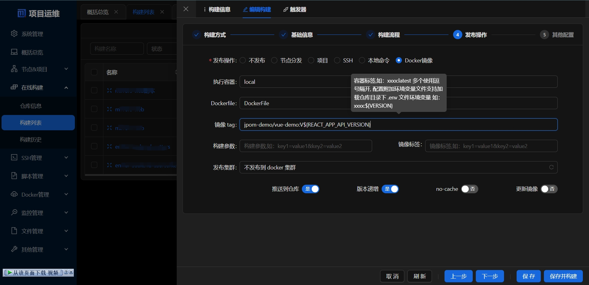

## 前言

> 本文主要介绍：
> 
> 如何使用 Jpom 中的容器构建来实现构建 docker 镜像并推送到远程仓库的流程

需要使用到的功能有：

1. 仓库管理
2. 在线构建 -> 构建列表：将仓库代码打包出运行文件
3. docker 管理
4. 在线构建发布到 docker 镜像并推送到远程仓库

> 注意：本文采用一键安装同时基于 2.11.6版本讲解,系统为 centos


## 需要准备的环境

1. Jpom 服务端（已经安装好、并且配置好了 node 环境）
2. 一个 web 项目仓库 并且已经有 `DockerFile` 文件
3. nginx配置文件，下文会贴出示例

本文就不再从零开始讲解安装教程，如果有不知道该如何安装的可以查看相关文档

-  [一键安装实践](/pages/15b7a2/)
-  [Docker 容器安装](/pages/c846d3/)
-  [离线安装](/pages/af288b/)

*本文使用物理机直接安装 Jpom 服务端的方式*

案例仓库地址：[https://gitee.com/autools/vue-demo](https://gitee.com/autools/vue-demo) 

## 操作指南

### 配置 docker 到 Jpom 

这个步骤主要是在 Jpom 添加 docker 服务，这样可以使用 Jpom 来管理 docker

**详细操作步骤：[操作文档>>](/pages/practice/docker-cli/)** (本文默认您已经配置好了)


这里我们为 docker 添加一个标签值为：`local` （注意这个值后续会用到）


> 如果服务端所在服务器中存在 docker 建议使用`自动探测`方式来添加

> 本文因为服务端所在的服务器存在 docker，所以 docker 地址为：`unix:///var/run/docker.sock`

### 配置 docker 仓库授权

本次采用阿里云容器镜像仓库为示例，其他 docker 仓库基本大同小异


### 配置项目仓库


仓库目录截图


### 配置在线构建


仓库**构建命令**：
**DockerFile**

```dockerfile
  # 基础镜像 目前仅支持 ubuntu-latest
  runsOn: ubuntu-latest
  # 使用哪个 docker 构建,填写 docker 标签 默认查询可用的第一个,如果 tag 查询出多个也选择第一个结果
  fromTag: local
  steps:
    - uses: node
      version: 16.3.0
  # 将此目录缓存到全局（多个构建可以共享此缓存目录）
      type: global
    - run: npm config set registry https://registry.npmmirror.com
  # 内置变量 ${JPOM_WORKING_DIR} ${JPOM_BUILD_ID}
    - run: cd  ${JPOM_WORKING_DIR}/ && npm i && npm run build
  # 给容器新增环境变量
  env:
    NODE_OPTIONS: --max-old-space-size=900

```

 您需要根据的项目来确定打包命令

仓库**产物目录**：`dist` 您需要根据的项目来确定产物目录（不了解产物目录该怎么填写的可以查看：[说明文档](/pages/0b946a/#产物目录)）

**执行容器**：这里填写在 Jpom 添加 docker 的标签值 ，我们前面为 docker 添加的标签值为 `local`，这里我们填它即可

> 执行容器指使用哪个 docker 构建,填写 docker 标签（ 标签在 docker 编辑页面配置） 默认查询可用的第一个,如果 tag 查询出多个将依次构建


**镜像 tag**：`registry.cn-shanghai.aliyuncs.com/jpom-demo/vue-demo:1.1`

这里注意：一定要写对命名空间不然没有办法正常推送到远程仓库


> 容器标签,如：xxxx:latest 多个使用逗号隔开
> 
> 这里根据您您的项目情况来填写您需要的镜像标签名，注意这里支持使用仓库目录下的变量文件替换变量来实现动态标签名（tag 名）
 
> 在 2.9.19+ 版本 需要手动配置 `附加环境变量` 来实现加载仓库目录下 .env 文件环境变量 

> 使用变量替换示例：xxxx:${VERSION}，添加 `附加环境变量` .env 文件 后，如果 .env 文件存在 VERSION=1.2 那么替换后为：xxxx:1.2

**Dockerfile**：这里添加的 `Dockerfile


> 如果您的 Dockerfile 在仓库根路径，直接填写对应的文件名即可。这里支持二级目录的作用主要是用于指定到二级目录里面执行构建，因为部分 Dockerfile 里面 `ADD` `COPY` 指令是相对路径的情况

**版本递增**

> 开启 dockerTag 版本递增后将在每次构建时自动将版本号最后一位数字同步为构建序号ID
> 
> 如：当前构建为第 100 次构建 
> 
> testtag:1.0 -> testtag:1.100
> 
> testtag:1.0.release -> testtag:1.100.release
> 
> 如果没有匹配到数字将忽略递增操作

### 执行构建


这里的镜像标签最终转换为：`registry.cn-shanghai.aliyuncs.com/jpom-demo/vue-demo:1.1`


### 查看远程仓库中的镜像


至此我们就可以通过 Jpom 来实现构建镜像并且可以推送到远程仓库了

## 补充说明

使用阿里云镜像仓库需要创建`命名空间`、`镜像仓库`，具体操作可以登录阿里云镜像仓库控制台查看

### 命令空间


### 镜像仓库


## 附件


**DockerFile**

```dockerfile
# production environment
FROM library/nginx:1.18.0-alpine
COPY  ${JPOM_WORKING_DIR}/build /usr/share/nginx/html
COPY tools/default.conf /etc/nginx/conf.d/default.conf
```