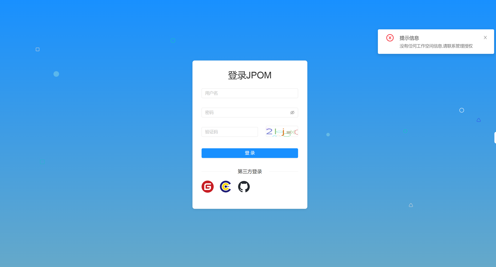

## 前言

Jpom 支持 Oauth2 登录，目前支持 [MaxKey](https://www.maxkey.top/)、Github、Gitee

## 配置 Oauth2

路径：【系统管理】-> 【配置管理】->【认证管理】

开启 Oauth2 后

### 开启自动创建用户

使用 Oauth2 方式登录如果当前系统中还未存在对应的账号系统将自动创建一个对应用户名的账户，初次登录仅能自动创建账号。

自动创建账户后请联系管理员分配权限组才能正常进入系统

:::tip 注意
使用 Oauth2 方式登录如果对应账号开启了 MFA 两步验证将忽略验证
:::

## 配置参考

