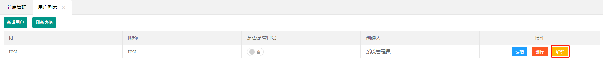

### 用户权限具体差异对比

<table>
<tr>
<th>功能</th><th>系统管理员</th><th>节点管理员</th><th>非管理员</th><th>服务管理员</th>
</tr>
<tr>
<td colspan='5'>节点管理</td>
</tr>
<tr>
<td>创建、修改、删除节点</td><td> √ </td><td> × </td><td> ×  </td><td>  ×  </td>
</tr>
<tr>
<td>创建、修改、删除节点分发 </td><td> √ </td><td>×</td><td> ×</td><td> √  </td>
</tr>
<tr>
<td> 分发白名单</td><td> √ </td><td> ×</td><td> × </td><td> × </td>
</tr>
<tr>
<td> 分发文件 </td><td> √</td><td>×</td><td> ×</td><td> √</td>
</tr>

<tr>
<td colspan='5'>项目管理</td>
</tr>

<tr>
<td>查看项目 </td><td> √</td><td> √ </td><td>√ </td><td>× </td>
</tr>
<tr>
<td> 创建项目 </td><td> √ </td><td>√ </td><td> ×</td><td>×</td>
</tr>
<tr>
<td>修改项目</td><td> √</td><td>√ </td><td>授权项目</td><td> × </td>
</tr>
<tr>
<td> 删除项目 </td><td> √</td><td> √ </td><td>× </td><td>×</td>
</tr>
<tr>
<td> 上传、删除项目jar </td><td> √ </td><td> 单独授权</td><td>单独授权</td><td>单独授权</td>
</tr>

<tr>
<td colspan='5'>系统管理</td>
</tr>
<tr>
<td>查看操作日志 </td><td> √ </td><td> √</td><td> √ </td><td>√</td>
</tr>
<tr>
<td>修改自身昵称、密码 </td><td> √ </td><td> √</td><td> √ </td><td> √ </td>
</tr>
<tr>
<td>查看用户列表</td><td>√  </td><td> x </td><td>×</td><td>√ </td>
</tr>
<tr>
<td>重置用户密码</td><td>√</td><td>×</td><td>×</td><td>×</td>
</tr>
<tr>
<td>创建用户、修改用户</td><td>√</td><td>×</td><td>×</td><td>√</td>
</tr>
<tr>
<td>修改系统白名单</td><td>√</td><td>×</td><td>×</td><td>×</td>
</tr>
<tr>
<td>查看、修改阿里云OSS配置</td><td>√</td><td>×</td><td> ×</td><td>×</td>
</tr>

<tr>
<td colspan='5'>节点其他管理</td>
</tr>
<tr>
<td>nginx管理</td><td> √</td><td> √</td><td> ×</td><td> ×</td>
</tr>
<tr>
<td>nginx静态资源配置 </td><td> √ </td><td>x</td><td> ×</td><td> × </td>
</tr>
<tr>
<td>证书管理 </td><td>√</td><td>√</td><td> × </td><td> ×</td>
</tr>
<tr>
<td> 删除证书 </td><td> √</td><td>× </td><td>× </td><td> ×</td>
</tr>

<tr>
<td colspan='5'>tomcat管理</td>
</tr>
<tr>
<td>添加、修改、删除</td><td> √</td><td> ×</td><td> ×</td><td> ×</td>
</tr>
<tr>
<td>tomcat状态管理</td><td> √</td><td>授权tomcat</td><td>授权tomcat</td><td>授权tomcat</td>
</tr>
<tr>
<td>上传tomcat文件</td><td> √</td><td>单独授权</td><td>单独授权</td><td>单独授权</td>
</tr>
<tr>
<td>删除tomcat文件</td><td> √</td><td>单独授权</td><td>单独授权</td><td>单独授权</td>
</tr>
</table>

  
###  防暴力登录账号机制

1. 当用户输错3三以上密码时，要求输出验证码才能登录
2. 当存在的用户登录次数超过外部配置的`alwaysLoginError`时，将锁定30分钟
3. 当存在的用户登录次数超过外部配置的`alwaysLoginError`两倍时，将锁定1小时
4. 当存在的用户登录次数超过外部配置的`alwaysLoginError`超过两倍时，将锁定10小时
5. 当登录某个Ip登录失败次数达到外部配置的`alwaysLoginError`十倍时，将锁定对应IP

###  解出用户登录锁定
1. 如锁定的是普通管理员，可由系统管理员在用户列表解锁或者等待自动解锁
    
2. 如锁定的是系统管理员，只能等待自动解锁或者手动修改用户配置文件